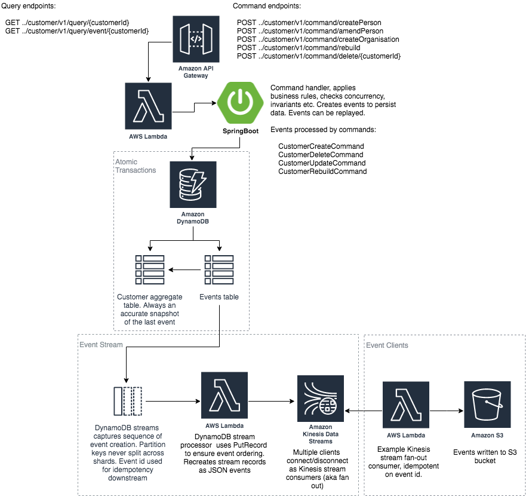

# Serverless Event Sourcing Customer Record




This application depicted above is intended as a straw man to demonstrate the benefits of a light-weight, purely serverless event sourcing system. Event sourcing stores every state change to the application as an event object. These event objects are stored in the sequence they were applied for the lifetime of the application.

Serverless was chosen to simplify the infrastructure with minimal dev ops; but, just as importantly, to use native cloud services rather than rely non-trivial specialist event sourced application frameworks. 

This application adopts the core principle of event sourcing in that all changes to domain objects are done as a result of an event. Consequently, this straw man follows the key idioms of event sourcing: commands, immutable events, event streams, events as the system of record and the ability to replay the event stream to a point in time to get different states of a customer.

The application perhaps deviates from a pure event sourcing pattern in these areas:

1. No separate read and write models (i.e. no [CQRS](https://martinfowler.com/bliki/CQRS.html)). The view of the customer is always up to date so events do not necessarily need to be re-played; consequentially, there is no eventual consistency lag. Of course, being event sourced, events can still be replayed at anytime, if desired
2. The app supports transactional concurrency, with an optimistic locking strategy
2. Allows deletes, so in accordance with [GDPR](https://gdpr-info.eu/art-17-gdpr/), customers can be forgotten

### System of Record

The `CustomerEvent` table stores every single event that is submitted to the system. This is the immutable system of record for the application.

The `Customer` table is the materialized view of the system of record, for quick access by the application. This is not the system of record, merely a view of the system of record. 

The customer can be retrieved from either the materialized view held in the `Customer` table or rebuilt directly from the event stream held in the `CustomerEvent` table

Both the `CustomerEvent` and `Customer` table are persisted in one atomic transaction, with [Amazon DynamoDB Transactions](https://docs.aws.amazon.com/amazondynamodb/latest/developerguide/transactions.html), so that data updates are always consistent across both tables  

### Event Stream

Events traverse the event stream to notify downstream clients. The event stream is transactional and comprises:

1. A DynamoDB stream from the `CustomerEvent` table, emitting transactional, reliable, time ordered sequence of events. Events remain in `CustomerEvent` for the lifetime of the application 
2. The `DynamoDbStreamProcessor` lambda picks data off the DynamoDB stream and reassembles it into a JSON representation of the event. This event is then written to the kinesis stream`CustomerEventKinesisStream`.
3. The Kinesis `CustomerEventKinesisStream` stream maintains the same time ordered sequence of events that can be fanned out to multiple interested clients
4. The `KinesisStreamS3Processor` lambda is an example of a HTTP/2 Kinesis client using [enhanced fan-out](https://docs.aws.amazon.com/streams/latest/dev/introduction-to-enhanced-consumers.html) to read from the stream. It writes the events to S3. Multiple other enhanced fan-out Lambdas could also access the same stream, acting independently of each other, maintaining their own transactional view of the stream 

### Outstanding Tasks

Stuff for the next iteration:

1. Downstream client (KinesisStreamS3Processor) is not idempotent
2. Consider rewriting in Node.js with TypeScript - the cold start times are a killer! 8 to 10 seconds

## Installation
The customer record app is written with [Spring Boot 2 framework](https://projects.spring.io/spring-boot/). The `StreamLambdaHandler` object is the main entry point for Lambda.

The application can be deployed in an AWS account using the [Serverless Application Model (SAM)](https://github.com/awslabs/serverless-application-model). 

The example `KinesisStreamS3Processor` lambda client needs an S3 bucket created to store a copy of all events sent to the application. The `template.yaml` file in the root folder contains the application definition. Once you've created the bucket, update the bucket name in `template.yaml` file, replacing
```
  EventBucket:
    Type: 'AWS::S3::Bucket'
    Properties:
      BucketName: "serverless-strawman-customer-event"
```
with
```
  EventBucket:
    Type: 'AWS::S3::Bucket'
    Properties:
      BucketName: "<YOUR EVENT BUCKET NAME>"
```
To build and install the customer record application you will need [AWS CLI](https://aws.amazon.com/cli/), [SAM](https://github.com/awslabs/serverless-application-model) and [Gradle](https://gradle.org/) installed on your computer.

Once they have been installed, from the shell, navigate to the root folder of the app and use gradle to build a deployable zip. Exclude the tests for the moment because they depdend on DynamoDB tables and these are only built when the application is deployed into AWS
```
$ gradle clean build -x test
```

This command should generate a `customer-record.zip` in the `build/distributions` folder. Now that we have generated the zip file, we can use SAM to package the template for deployment. 

You will need a deployment S3 bucket to store the artifacts for deployment. Once you have created the deployment S3 bucket, run the following command from the app root folder:

```
$ sam package --output-template-file output-template.yaml --s3-bucket <YOUR DEPLOYMENT S3 BUCKET NAME>

Uploading to xxxxxxxxxxxxxxxxxxxxxxxxxx  6464692 / 6464692.0  (100.00%)
Successfully packaged artifacts and wrote output template to file output-template.yaml.
Execute the following command to deploy the packaged template
aws cloudformation deploy --template-file /your/path/output-sam.yaml --stack-name <YOUR STACK NAME>
```

You can now use the cli to deploy the application. Choose a stack name and run the `sam deploy` command.
 
```
$ sam deploy --template-file output-template.yaml --stack-name <YOUR STACK NAME> --capabilities CAPABILITY_IAM
```

Once the application is deployed, you can describe the stack to show the API endpoint that was created. The endpoint should be the `CustomerRecordFuncApi` `OutputKey` of the `Outputs` property:

```
$ aws cloudformation describe-stacks --stack-name <YOUR STACK NAME>
{
    "Stacks": [
        {
            "StackId": "arn:aws:cloudformation:eu-west-2:022099488461:stack/cust-record/c3f63260-3ce5-11e9-b081-02d140453e24",
            "StackName": "cust-record",
            "ChangeSetId": "arn:aws:cloudformation:eu-west-2:022099488461:changeSet/awscli-cloudformation-package-deploy-1551631448/0a0f89fb-64ab-4987-8264-1f95676c3ec5",
            "Description": "customer-record written with aws-serverless-java-container spring boot",
            "CreationTime": "2019-03-02T12:21:54.455Z",
            "LastUpdatedTime": "2019-03-03T16:44:18.858Z",
            "RollbackConfiguration": {},
            "StackStatus": "UPDATE_COMPLETE",
            "DisableRollback": false,
            "NotificationARNs": [],
            "Capabilities": [
                "CAPABILITY_IAM"
            ],
            "Outputs": [
                {
                    "OutputKey": "CustomerRecordFuncApi",
                    "OutputValue": "https://xxxxxxx.execute-api.eu-west-2.amazonaws.com/Prod/customer",
                    "Description": "URL for application",
                    "ExportName": "CustomerRecordFuncApi"
                }
            ],
            "Tags": [],
            "EnableTerminationProtection": false,
            "DriftInformation": {
                "StackDriftStatus": "NOT_CHECKED"
            }
        }
    ]
}
```

The `OutputValue` above gives the URL of the app. Using the URL, execute the following curl command, or copy into a browser, to test the app

```
$ curl https://xxxxxxx.execute-api.eu-west-2.amazonaws.com/Prod/customer/v1/query/alive
```
If any errors were encountered, examine the stack events to diagnose the issue

```
$ aws cloudformation describe-stack-events --stack-name <YOUR STACK NAME>
```

At any time, you may delete the stack

```
$ aws cloudformation delete-stack --stack-name <YOUR STACK NAME>
```

Create a customer, you may use the `customerId` output from the curl command below for future commands in the `{customerId}` variable

```
$ curl -H "Content-Type: application/json" -X POST https://xxxxxxx.execute-api.eu-west-2.amazonaws.com/Prod/customer/v1/command/createPerson -d '
  {
      "customerName": {
          "title": "MR",
          "foreNames": "Test Forename",
          "surname": "Test surname"
      },
  
      "customerAddress":{
          "addressType":"STRUCTURED",
          "address": {
               "addressLine1": "test line 1",
               "addressLine2": "test line 2",
               "addressLine3": "test line 3",
               "postalCode": "SA66DD"
          }
      }
  }'
```

Retrieve a customer

```
$ curl https://xxxxxxx.execute-api.eu-west-2.amazonaws.com/Prod/customer/v1/query/{customerId}
```
Get all the immutable events for a customer

```
$ curl https://xxxxxxx.execute-api.eu-west-2.amazonaws.com/Prod/customer/v1/query/event/{customerId}
```

Rebuild a customer from the event stream from a point in time

```
$ curl -H "Content-Type: application/json" -X POST https://xxxxxxx.execute-api.eu-west-2.amazonaws.com/Prod/customer/v1/command/rebuild -d '
  {"customerId":"c5ae5538-7f75-4dca-bc01-e92e011626fa","timestamp":"2019-03-03T15:30:16.481Z"}'
```

Delete a customer and all their events, leaving a only a delete event for the customerId to record the delete

```
$ curl -H "Content-Type: application/json" -X POST https://xxxxxxx.execute-api.eu-west-2.amazonaws.com/Prod/customer/v1/command/delete/{customerId}
```

Execute gradle again to confirm the local unit tests now execute successfully

```
$ gradle clean build
```

