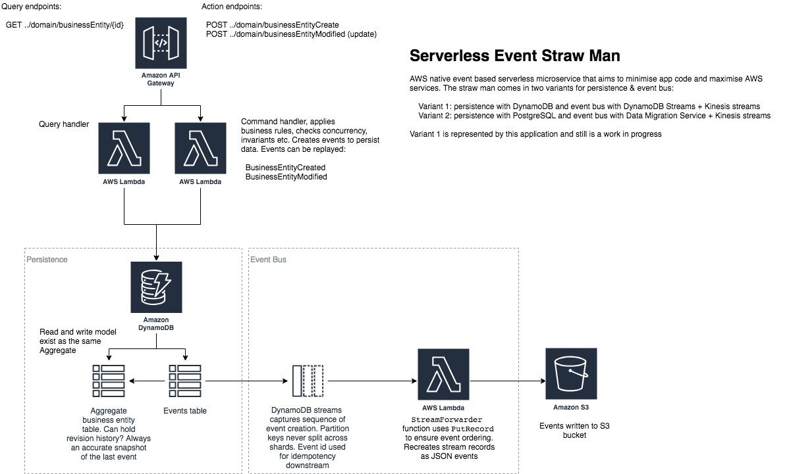

# Serverless Event Based Customer Record



This application depicted above is intended as a straw man to demonstrate the benefits of an event sourced system, but without actually being a true event sourced system. It has many characteristics of event sourcing, such as commands, immutable events (everything is in fact an immutable event) and the ability to replay the event stream to a point in time to get different states of a customer.

The app deviates from true event sourcing in these areas:

1. No separate read and write models (i.e. no [CQRS](https://martinfowler.com/bliki/CQRS.html)). The view of the customer is always up to date so events do not need to be re-played (unless you want to); consequentially, there is no eventual consistency lag.
2. The app supports transactional concurrency, with an optimistic locking strategy
2. Allows deletes, so that customers can be forgotten

### Outstanding Tasks

Stuff for the next iteration:

1. Finish issuing events to downstream applications with [Amazon Kinesis](https://aws.amazon.com/kinesis/)
2. Ensure the app is transactional by using [Amazon DynamoDB Transactions](https://docs.aws.amazon.com/amazondynamodb/latest/developerguide/transactions.html), so that data updates are atomic across both the Customer and CustomerEvent table
3. Consider rewriting in Node.js with TypeScript - the cold start times are a killer! 8 to 10 seconds

## Installation
The customer record app is written with [Spring Boot 2 framework](https://projects.spring.io/spring-boot/). The `StreamLambdaHandler` object is the main entry point for Lambda.

The application can be deployed in an AWS account using the [Serverless Application Model (SAM)](https://github.com/awslabs/serverless-application-model). 

The `template.yaml` file in the root folder contains the application definition. Update the bucket name in `template.yaml` file, replacing
```
  EventBucket:
    Type: 'AWS::S3::Bucket'
    Properties:
      BucketName: "serverless-strawman-customer-event"
```
with
```
  EventBucket:
    Type: 'AWS::S3::Bucket'
    Properties:
      BucketName: "<<YOUR_UNIQUE_BUCKET_NAME>>"
```
To build and install the customer record application you will need [AWS CLI](https://aws.amazon.com/cli/), [SAM](https://github.com/awslabs/serverless-application-model) and [Gradle](https://gradle.org/) installed on your computer.

Once they have been installed, from the shell, navigate to the root folder of the app and use gradle to build a deployable zip. Exclude the tests for the moment because they depdend on DynamoDB tables and these are only built when the application is deployed into AWS
```
$ gradle clean build -x test
```

This command should generate a `customer-record.zip` in the `build/distributions` folder. Now that we have generated the zip file, we can use SAM to package the template for deployment. 

You will need an S3 bucket to store the artifacts for deployment. Once you have created the S3 bucket, run the following command from the app root folder:

```
$ sam package --output-template-file output-template.yaml --s3-bucket <YOUR S3 BUCKET NAME>

Uploading to xxxxxxxxxxxxxxxxxxxxxxxxxx  6464692 / 6464692.0  (100.00%)
Successfully packaged artifacts and wrote output template to file output-template.yaml.
Execute the following command to deploy the packaged template
aws cloudformation deploy --template-file /your/path/output-sam.yaml --stack-name <YOUR STACK NAME>
```

You can now use the cli to deploy the application. Choose a stack name and run the `sam deploy` command.
 
```
$ sam deploy --template-file output-template.yaml --stack-name <YOUR STACK NAME> --capabilities CAPABILITY_IAM
```

Once the application is deployed, you can describe the stack to show the API endpoint that was created. The endpoint should be the `CustomerRecordFuncApi` `OutputKey` of the `Outputs` property:

```
$ aws cloudformation describe-stacks --stack-name <YOUR STACK NAME>
{
    "Stacks": [
        {
            "StackId": "arn:aws:cloudformation:eu-west-2:022099488461:stack/cust-record/c3f63260-3ce5-11e9-b081-02d140453e24",
            "StackName": "cust-record",
            "ChangeSetId": "arn:aws:cloudformation:eu-west-2:022099488461:changeSet/awscli-cloudformation-package-deploy-1551631448/0a0f89fb-64ab-4987-8264-1f95676c3ec5",
            "Description": "customer-record written with aws-serverless-java-container spring boot",
            "CreationTime": "2019-03-02T12:21:54.455Z",
            "LastUpdatedTime": "2019-03-03T16:44:18.858Z",
            "RollbackConfiguration": {},
            "StackStatus": "UPDATE_COMPLETE",
            "DisableRollback": false,
            "NotificationARNs": [],
            "Capabilities": [
                "CAPABILITY_IAM"
            ],
            "Outputs": [
                {
                    "OutputKey": "CustomerRecordFuncApi",
                    "OutputValue": "https://xxxxxxx.execute-api.eu-west-2.amazonaws.com/Prod/customer",
                    "Description": "URL for application",
                    "ExportName": "CustomerRecordFuncApi"
                }
            ],
            "Tags": [],
            "EnableTerminationProtection": false,
            "DriftInformation": {
                "StackDriftStatus": "NOT_CHECKED"
            }
        }
    ]
}
```

The `OutputValue` above gives the URL of the app. Using the URL, execute the following curl command, or copy into a browser, to test the app

```
$ curl https://xxxxxxx.execute-api.eu-west-2.amazonaws.com/Prod/customer/v1/query/alive
```
If any errors were encountered, examine the stack events to diagnose the issue

```
$ aws cloudformation describe-stack-events --stack-name <YOUR STACK NAME>
```

At any time, you may delete the stack

```
$ aws cloudformation delete-stack --stack-name <YOUR STACK NAME>
```

Create a customer, you may use the `customerId` output from the curl command below for future commands in the `{customerId}` variable

```
$ curl -H "Content-Type: application/json" -X POST https://xxxxxxx.execute-api.eu-west-2.amazonaws.com/Prod/customer/v1/command/createPerson -d '
  {
      "customerName": {
          "title": "MR",
          "foreNames": "Test Forename",
          "surname": "Test surname"
      },
  
      "customerAddress":{
          "addressType":"STRUCTURED",
          "address": {
               "addressLine1": "test line 1",
               "addressLine2": "test line 2",
               "addressLine3": "test line 3",
               "postalCode": "SA66DD"
          }
      }
  }'
```

Retrieve a customer

```
$ curl https://xxxxxxx.execute-api.eu-west-2.amazonaws.com/Prod/customer/v1/query/get/{customerId}
```
Get all the immutable events for a customer

```
$ curl https://xxxxxxx.execute-api.eu-west-2.amazonaws.com/Prod/customer/v1/query/event/{customerId}
```

Rebuild a customer from the event stream, with an example message body

```
$ curl -H "Content-Type: application/json" -X POST https://xxxxxxx.execute-api.eu-west-2.amazonaws.com/Prod/customer/v1/command/rebuild -d '
  {"customerId":"c5ae5538-7f75-4dca-bc01-e92e011626fa","timestamp":"2019-03-03T15:30:16.481Z"}'
```

Delete a customer and all their events, leaving a only a delete event for the customerId to record the delete

```
$ curl -H "Content-Type: application/json" -X POST https://xxxxxxx.execute-api.eu-west-2.amazonaws.com/Prod/customer/v1/command/delete/{customerId}
```

Execute gradle again to confirm the local unit tests now execute successfully

```
$ gradle clean build
```

